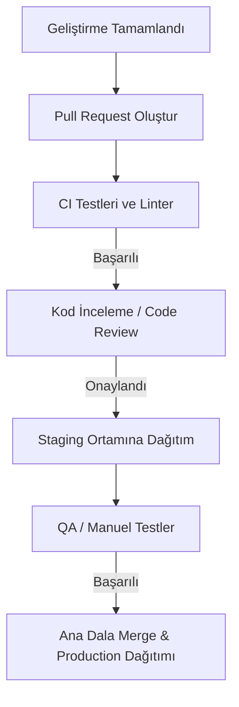

# Surum Yayina Alma (Deployment)

Kod değişikliklerinin test edilmesinden canlı ortama (production) çıkılmasına kadar geçen süreç adımları.

## Akış Şeması

## Canlıya Geçiş Adımları

1.  **Kod İncelemesi (Code Review)**: En az 2 kıdemli geliştirici tarafından PR onaylanmalıdır.
2.  **Staging Testleri**: Otomatik deployment sonrasında staging ortamında işlevsel testler koşturulur.
3.  **Production Deployment**: Staging testleri onaylandıktan sonra GitHub Actions arayüzünden sürüm etiketi tetiklenerek canlı dağıtım başlatılır.
4.  **Canlı İzleme**: Dağıtım sonrasında Grafana ve Sentry logları 15 dakika boyunca izlenerek hata artışı olup olmadığı kontrol edilir.
